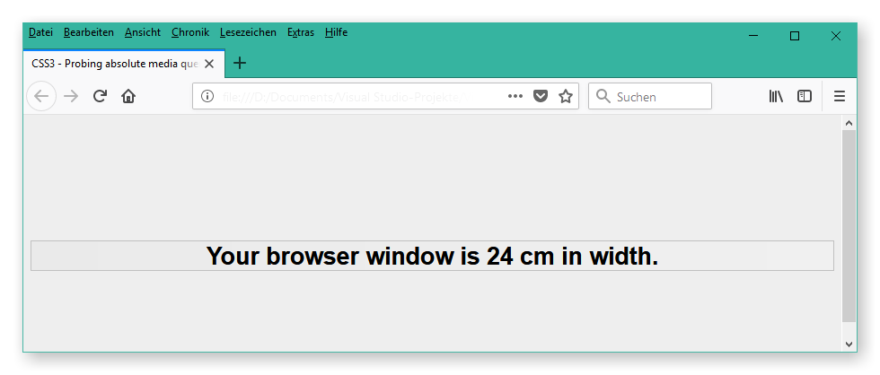

# CSS3 Absolute Length Media Query Probing Page
This repository provides a `HTML` web page, showing the current web page's width in `cm`.

You can use this web page to test whether a web browser reads OS device information and is able to correctly apply that information to CSS3 media queries using absolute lengths.

The web page outputs the width of the viewport according the media queries like:

```css
@media screen and (min-width: ...cm)
```

### Reason

Currently, many CSS design frameworks, like [Bootstrap](https://getbootstrap.com/) for instance, are using pixels for their media queries. Yet, that approach is not robust and safe for deciding which layout to use: A user may use a large screen with `HDTV` resolution or a smartphone with `UHD` resolution.

So, if web designers design their media queries on pixel basis, users of large screens may be presented with smartphone layout while users of smartphones may be presented with desktop layout.

### Conclusion

A better solution for deciding which layout to use at which kind of device is to decide based on a browser's viewport width in absolute length, e. g. `cm`.

So, I suggest to refrain from using device pixels (`px`) in your CSS media queries and, instead, utilize absolute lengths, like `cm`.

[See here](https://www.w3.org/TR/css-values-3/#absolute-lengths) for the official list of currently valid absolute lengths.

### How to Use

To test whether CSS media queries using absolute lengths will successfully be displayed on your web browser, simply pull this repository and open the `mediaQueries.html` file downloaded from the repository.

The HTML page will then display your web browser window's width in cm:



Alternatively you may find the web page online here: http://www.axeldahmen.de/CssMQTest/mediaQueries.html

HTH,<br/>
[Axel Dahmen](http://www.axeldahmen.de/)
